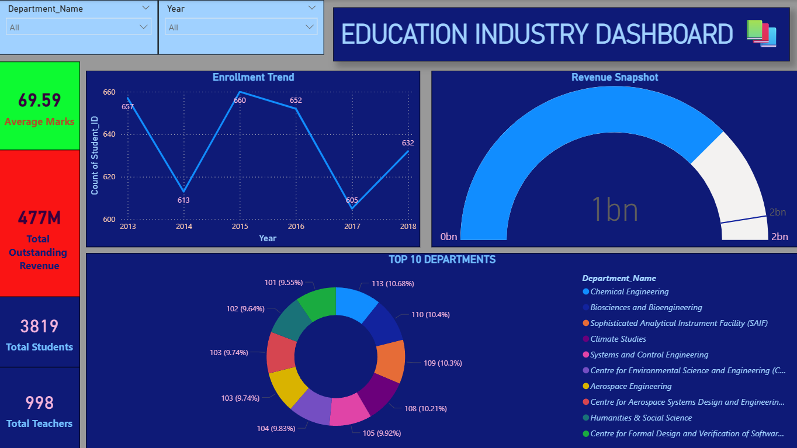
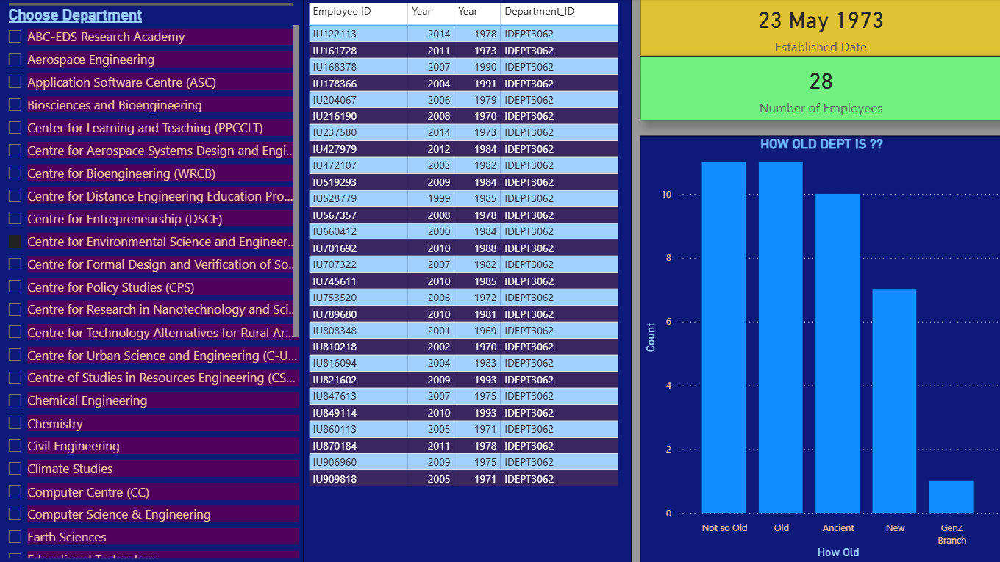

⭐ If you like this project, give it a star!!

# 📊 Education Analytics Dashboard (Power BI)

## 🎥 Demo Video

  

---

## 🚀 Project Overview

This project analyzes student data to derive insights on academic performance, department allocation, and student satisfaction.

The dashboard focuses on identifying trends in:

* Top Departments
* Student satisfaction rate
* Student Performance
* Department-wise demand and allocation
* Revenue Analysis

---

## 🎯 Key Features

* 📌 KPI Metrics (Total Students, Satisfaction Rate)
* 📊 Choice vs Admission Analysis
* 📈 Department-wise Insights
* 🔍 Interactive Filters & Drilldowns

---

## 🛠️ Tools & Technologies

* Power BI
* Excel (Data Cleaning)
* DAX (Calculated Measures)

---

## 📸 Dashboard Preview

### 🔹 Overview

### 🔹 Department Analysis

---

## 📊 Key Insight

* Most of the students enrolled in 2015 and they have average marks equal to average marks of institute, means they have big contribution in revenue generation
* Topper of the institute is from 2015 batch - more focus to 2015 batch should be given
* Most of the Pending fees is from Departments - SAIF, Humanities and Social Sciences, Biosciences and Bioengineering
* 20% of the students are Defaulters which means they have fees pending > 300000
* Almost 50 % or 1580 students are above and equal to 29 which means some classes should be shifted to evening
* Average age is also 28 which means college is some PG (Post-Graduation) college
* Most new branch is Chemistry

---

## 📁 Files Included

* `.pbix` file for full dashboard
* Images of all the slides in dashboard
* Demo video

---

## 💡 Future Improvements

* Integrate real-time data
* Improve UI/UX design

---

## 🙌 Author

Tushar Chaudhary
